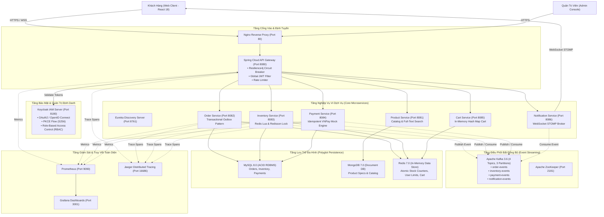

# HỆ THỐNG THƯƠNG MẠI ĐIỆN TỬ FLASH SALE TẢI CAO (DISTRIBUTED MICROSERVICES PLATFORM)

[](https://spring.io/projects/spring-boot)
[](https://spring.io/projects/spring-cloud)
[](https://react.dev/)
[](https://kafka.apache.org/)
[](https://redis.io/)
[-blueviolet.svg)](https://www.keycloak.org/)
[](https://www.docker.com/)
[](https://github.com/features/actions)

Hệ thống Thương Mại Điện Tử Chịu Tải Cao Hỗ Trợ Flash Sale được xây dựng theo **Kiến trúc Vi dịch vụ Hướng Sự kiện (Event-Driven Microservices Architecture)**, thiết kế để giải quyết bài toán tranh chấp tồn kho (Race Condition), nghẽn cơ sở dữ liệu quan hệ, và bảo đảm tính nhất quán dữ liệu phân tán (Distributed Data Consistency) dưới áp lực tải lớn của các phiên bán hàng đồng thời.

---

## SƠ ĐỒ KIẾN TRÚC HỆ THỐNG TỔNG THỂ



---

## ĐẶC TRƯNG KIẾN TRÚC

1. **Trừ tồn kho nguyên tử $O(1)$ với Redis Lua Script:**
   * Thay vì sử dụng cơ chế khóa bi quan `SELECT ... FOR UPDATE` gây nghẽn hàng đợi tại RDBMS, logic trừ tồn kho và kiểm soát hạn mức (tối đa 2 sản phẩm/khách hàng) được đóng gói trong **Redis Lua Script**, thực thi nguyên tử với độ phức tạp $O(1)$ và thời gian xử lý từ **0.8ms – 1.5ms**, loại bỏ nguy cơ bán âm kho (Overselling) và hiện tượng Race Condition.
2. **Giao dịch phân tán Saga Choreography kết hợp Transactional Outbox:**
   * Quản lý chuỗi giao dịch qua nhiều vi dịch vụ độc lập (Order -> Inventory -> Payment -> Notification) theo mô hình Saga Choreography phi tập trung. Kết hợp Transactional Outbox Pattern để bảo đảm an toàn dữ liệu kép (Dual-Write) và đạt tính nhất quán cuối cùng (**Eventual Consistency**).
3. **Khóa phân tán Redisson (Distributed Lock):**
   * Bảo vệ các tài nguyên chia sẻ có độ tranh chấp cao trong cơ sở dữ liệu quan hệ với thuật toán đồng thuận phân tán, cơ chế Watchdog tự động gia hạn thời gian giữ khóa và phòng tránh tình trạng Deadlock.
4. **Bảo mật và quản lý định danh chuẩn hóa (Keycloak OIDC PKCE):**
   * Triển khai giao thức OAuth 2.1 với **Authorization Code Flow kết hợp PKCE** (phương thức S256). Phía giao diện Single Page Application hoàn toàn không lưu trữ Client Secret. Hệ thống phân quyền dựa trên vai trò (RBAC) với các quyền hạn cụ thể (`ROLE_CUSTOMER` và `ROLE_ADMIN`).
5. **Khả năng dung lỗi và tự phục hồi (Resilience4j Circuit Breaker):**
   * Tích hợp bộ ngắt mạch tại API Gateway; khi một vi dịch vụ phụ thuộc phát sinh lỗi vượt ngưỡng cấu hình, hệ thống ngắt mạch và kích hoạt cơ chế phản hồi dự phòng (Fallback), ngăn chặn hiện tượng quá tải dây chuyền (Cascading Failure).
6. **Lưu trữ đa hình (Polyglot Persistence):**
   * Phân định cơ sở dữ liệu phù hợp với từng miền dữ liệu nghiệp vụ: MySQL 8.0 cho dữ liệu giao dịch bảo đảm tính toàn vẹn ACID, MongoDB 7.0 cho danh mục sản phẩm phi cấu trúc, và Redis 7.0 cho truy xuất bộ nhớ tạm tốc độ cao.
7. **Hạ tầng quan sát và giám sát tập trung (Full-Stack Observability):**
   * Thu thập chỉ số hiệu năng thời gian thực qua Prometheus, hiển thị biểu đồ qua Grafana (RPS, phân vị trễ p95, trạng thái kết nối cơ sở dữ liệu HikariCP) và truy vết luồng phân tán qua Jaeger Tracing.

---

## DANH MỤC CÁC PHÂN HỆ VI DỊCH VỤ

| Tên phân hệ | Cổng (Port) | Nền tảng công nghệ | Cơ sở dữ liệu / Lưu trữ | Chức năng chính & Mẫu thiết kế |
| :--- | :--- | :--- | :--- | :--- |
| **`eureka-server`** | `8761` | Spring Cloud Netflix Eureka | Bộ nhớ tạm (In-Memory) | Đăng ký dịch vụ, phát hiện dịch vụ (Service Discovery) & kiểm tra trạng thái hoạt động |
| **`api-gateway`** | `8080` | Spring Cloud Gateway (Netty) | - | Cổng vào tập trung, Circuit Breaker Resilience4j, xác thực JWT, điều phối lưu lượng Rate Limiter |
| **`product-service`** | `8081` | Spring Boot 3 + Spring Data | MongoDB 7.0 | Quản lý danh mục sản phẩm, tìm kiếm, phân loại dữ liệu |
| **`order-service`** | `8082` | Spring Boot 3 + JPA | MySQL 8.0 + Redis 7.0 | Tiếp nhận đơn hàng, Transactional Outbox Pattern, phát sự kiện khởi tạo giao dịch Saga lên Kafka |
| **`inventory-service`**| `8083` | Spring Boot 3 + JPA | MySQL 8.0 + Redis 7.0 | Quản lý phiên Flash Sale, trừ kho nguyên tử qua Redis Lua, Redisson Lock, xử lý Idempotent Consumer |
| **`payment-service`** | `8084` | Spring Boot 3 + JPA | MySQL 8.0 | Xử lý thanh toán mô phỏng VNPay Sandbox, bảo đảm tính Idempotency |
| **`cart-service`** | `8085` | Spring Boot 3 + Spring Data | Redis 7.0 | Quản lý giỏ hàng trên cấu trúc Redis Hash Map $O(1)$ |
| **`notification-service`**| `8086` | Spring Boot 3 + WebSocket STOMP | - | Tiêu thụ sự kiện `PaymentCompletedEvent` từ Kafka và truyền thông báo thời gian thực tới máy khách |
| **`frontend`** | `3000` | React 18 + Vite + TS + Zustand | Trình duyệt | Giao diện tương tác khách hàng, giám sát tiến trình Saga thời gian thực |

---

## YÊU CẦU MÔI TRƯỜNG VẬN HÀNH (PREREQUISITES)

* **Docker & Docker Compose:** Docker Engine 24.0+ (Khuyến nghị cấp phát tối thiểu 4 Cores CPU và 6GB - 8GB RAM).
* **Java Development Kit (Tùy chọn nếu chạy độc lập):** JDK 17 (Eclipse Temurin hoặc OpenJDK 17).
* **Apache Maven (Tùy chọn):** Maven 3.9+.
* **Node.js (Tùy chọn):** Node.js 18.x hoặc 20.x LTS.

---

## HƯỚNG DẪN KHỞI CHẠY HỆ THỐNG (DOCKER COMPOSE)

Toàn bộ hệ thống gồm hạ tầng dữ liệu, middleware điều phối, các vi dịch vụ và giao diện người dùng được tự động hóa triển khai qua Docker Compose:
* Tự động khởi tạo các chủ đề Kafka (4 Topics với 3 Partitions).
* Tự động nạp cấu hình Realm `ecommerce-realm`, các phân quyền và tài khoản mặc định vào Keycloak.
* Tự động nạp dữ liệu mẫu cho danh mục sản phẩm và chỉ số tồn kho ban đầu vào MongoDB và MySQL.

```bash
# 1. Di chuyển vào thư mục dự án
cd FlashSaleECommercePlatform

# 2. Khởi tạo tệp cấu hình môi trường từ mẫu
cp .env.example .env

# 3. Khởi chạy toàn bộ hệ thống
docker compose up -d --build
```

*Lưu ý: Có thể đóng gói trước mã nguồn bằng Maven trên môi trường host để tối ưu thời gian tạo Docker image:*
```bash
cd backend && mvn clean package -DskipTests && cd ..
docker compose up -d --build
```

### Kiểm tra trạng thái dịch vụ sau khi khởi động:
```bash
docker ps --format "table {{.Names}}\t{{.Status}}\t{{.Ports}}"
```
Xác nhận toàn bộ các dịch vụ đạt trạng thái hoạt động bình thường (`Up` hoặc `Up (healthy)`).

---

## HƯỚNG DẪN KHỞI CHẠY TRÊN MÔI TRƯỜNG PHÁT TRIỂN (LOCAL DEVELOPMENT)

Quy trình triển khai dịch vụ độc lập trên môi trường phát triển (IDE) nhằm phục vụ kiểm thử và gỡ lỗi:

1. **Khởi động các dịch vụ hạ tầng phụ trợ bằng Docker:**
   ```bash
   docker compose up -d mysql-db mongodb redis zookeeper kafka kafka-init-topics keycloak prometheus grafana jaeger
   ```
2. **Khởi động các phân hệ Spring Boot:**
   * Eureka Server: `cd backend/eureka-server && mvn spring-boot:run` (Port 8761)
   * API Gateway: `cd backend/api-gateway && mvn spring-boot:run` (Port 8080)
   * Product Service: `cd backend/product-service && mvn spring-boot:run` (Port 8081)
   * Order Service: `cd backend/order-service && mvn spring-boot:run` (Port 8082)
   * Inventory Service: `cd backend/inventory-service && mvn spring-boot:run` (Port 8083)
   * Payment Service: `cd backend/payment-service && mvn spring-boot:run` (Port 8084)
   * Cart Service: `cd backend/cart-service && mvn spring-boot:run` (Port 8085)
   * Notification Service: `cd backend/notification-service && mvn spring-boot:run` (Port 8086)
3. **Khởi động ứng dụng giao diện máy khách:**
   ```bash
   cd frontend
   cp .env.example .env
   npm install
   npm run dev
   ```

---

## ĐỊA CHỈ TRUY CẬP VÀ THÔNG TIN TÀI KHOẢN HỆ THỐNG

| Phân hệ / Cổng dịch vụ | Địa chỉ truy cập (URL) | Tài khoản / Mật khẩu | Mục đích sử dụng |
| :--- | :--- | :--- | :--- |
| **Giao diện Web khách hàng** | `http://localhost:3000` | `customer` / `password` | Tương tác giao diện người dùng, đặt hàng và theo dõi tiến trình Saga |
| **Spring Cloud API Gateway** | `http://localhost:8080` | - | Điểm tiếp nhận API tập trung, kiểm tra Actuator Health `/actuator/health` |
| **Eureka Service Registry** | `http://localhost:8761` | Không yêu cầu xác thực | Giám sát danh sách các phiên bản dịch vụ đang hoạt động |
| **Keycloak IAM Server** | `http://localhost:8180` | `admin` / `adminpassword` | Quản trị định danh OAuth2, cấu hình Realm `ecommerce-realm` & PKCE Client |
| **Grafana Monitoring** | `http://localhost:3001` | `admin` / `admin123456` | Bảng điều khiển giám sát: Throughput RPS, phân vị trễ p95, DB Connection Pool |
| **Prometheus Metrics** | `http://localhost:9090` | Không yêu cầu xác thực | Máy chủ thu thập dữ liệu chỉ số hiệu năng (Actuator Scraper) |
| **Jaeger Distributed Tracing**| `http://localhost:16686` | Không yêu cầu xác thực | Truy vết chuỗi thực thi phân tán xuyên suốt các dịch vụ |

---

## QUY TRÌNH KIỂM THỬ VÀ ĐỐI SOÁT (TESTING & VERIFICATION)

Hệ thống được thiết lập các bộ kiểm thử tự động, từ mức mã nguồn đến kiểm thử tải phân tán:

### 1. Kiểm thử tự động kịch bản nghiệp vụ:
Kịch bản tự động gửi yêu cầu HTTP, kiểm tra mã phản hồi và xác minh trạng thái tồn kho thực tế trong cơ sở dữ liệu MySQL:
```bash
node scripts/test_demo_scenarios_automation.mjs
```
Nội dung kiểm tra bao gồm 4 kịch bản:
- Giao dịch đặt hàng thành công thông thường (Happy Path).
- 5 khách hàng gửi yêu cầu mua hàng đồng thời (High Concurrency).
- 5 khách hàng tranh chấp 1 sản phẩm cuối cùng (Anti-Overselling).
- Kiểm tra cơ chế chặn yêu cầu khi vượt quá hạn mức cá nhân cho phép.

### 2. Giám sát luồng sự kiện phân tán qua Kafka:
Thực hiện trên 2 cửa sổ dòng lệnh độc lập:
* **Cửa sổ 1:** Lắng nghe luồng sự kiện phân tán:
  ```bash
  node scripts/kafka_live_tail.mjs
  ```
* **Cửa sổ 2:** Phát sinh yêu cầu đặt hàng:
  ```bash
  node scripts/realtime_scenario_runner.mjs 1
  ```
* Kết quả: Cửa sổ 1 ghi nhận tuần tự các sự kiện được chuyển tiếp qua Kafka theo đúng tiến trình Saga (`ORDER_CREATED`, `INVENTORY_RESERVED`, `PAYMENT_COMPLETED`, `ORDER_CONFIRMED`).

### 3. Kiểm thử tải phân tán (Distributed Load Testing):
Hỗ trợ các công cụ kiểm thử tải chuyên dụng:
```powershell
# Thực hiện kiểm thử bằng Apache JMeter 5.6.3 (xuất báo cáo HTML):
powershell -ExecutionPolicy Bypass -File .\scripts\load-testing\run_load_test.ps1 -Engine jmeter -Threads 500 -Duration 30

# Thực hiện kiểm thử bằng High-Concurrency Runner:
powershell -ExecutionPolicy Bypass -File .\scripts\load-testing\run_load_test.ps1 -Engine runner -Requests 5000 -Concurrency 50

# Thực hiện kiểm thử bằng k6:
powershell -ExecutionPolicy Bypass -File .\scripts\load-testing\run_load_test.ps1 -Engine k6
```

### 4. Kiểm thử mức mã nguồn (Unit & Integration Tests):
```bash
# Kiểm thử toàn bộ các phân hệ Backend Spring Boot:
cd backend && mvn clean test

# Kiểm thử phân hệ Frontend React:
cd frontend && npm test
```

### 5. Khôi phục dữ liệu kiểm thử (Reset Test Data):
Hệ thống cung cấp cơ chế khôi phục trạng thái kho hàng và đặt lại hạn mức mua sắm phục vụ kiểm thử lặp lại mà không làm mất thông tin tài khoản người dùng:
* **Cách 1 (Trên giao diện Web):** Sử dụng chức năng "Làm mới dữ liệu kiểm thử" tại thanh thông báo đầu trang.
* **Cách 2 (Dòng lệnh):**
  ```bash
  node scripts/reset_demo_data.mjs
  ```
* **Phạm vi tác động:** Khôi phục số lượng tồn kho của các mặt hàng về giá trị cấu hình ban đầu và xóa bộ đếm hạn mức mua cá nhân/giỏ hàng trong Redis; toàn bộ cấu hình tài khoản và phân quyền trên Keycloak được giữ nguyên.

---

## TÀI LIỆU KỸ THUẬT KÈM THEO

Các tài liệu phân tích chuyên sâu được lưu trữ tại thư mục [`docs/`](docs/):

* **[Tài liệu Kiến trúc Kỹ thuật Hệ thống (`docs/ARCHITECTURE.md`)](docs/ARCHITECTURE.md):** Phân tích chi tiết thuật toán Redis Lua $O(1)$, mô hình Saga Choreography, Outbox Pattern, khóa phân tán Redisson và chiến lược lưu trữ đa hình.
* **[Tài liệu Hướng dẫn Kiểm thử và Đối soát (`docs/TESTING_AND_VERIFICATION_GUIDE.md`)](docs/TESTING_AND_VERIFICATION_GUIDE.md):** Quy trình chi tiết thực hiện kiểm thử tự động, kiểm thử tải và đối soát tính toàn vẹn dữ liệu.
* **[Kịch bản Thực nghiệm và Đánh giá Hệ thống (`docs/LIVE_DEMO_GUIDE.md`)](docs/LIVE_DEMO_GUIDE.md):** Kịch bản các ca thử nghiệm và vận hành hệ thống phục vụ công tác nghiệm thu và đánh giá.
* **[Tài liệu Đặc tả API (`docs/api/API_REFERENCE.md`)](docs/api/API_REFERENCE.md):** Đặc tả chi tiết các giao diện lập trình ứng dụng RESTful API và kết nối WebSocket STOMP.
* **[Postman Collection (`docs/api/Flash_Sale_ECommerce_API.postman_collection.json`)](docs/api/Flash_Sale_ECommerce_API.postman_collection.json):** Tệp cấu hình kiểm thử các điểm cuối API qua Postman.

---

## QUY TRÌNH CI/CD (GITHUB ACTIONS & DOCKER REGISTRY)

Hệ thống thiết lập đường ống tích hợp và triển khai liên tục (**CI/CD Pipeline**) qua GitHub Actions (`.github/workflows/ci-cd.yml`):
1. **Kiểm thử tự động:** Mỗi thay đổi mã nguồn đẩy lên kho lưu trữ được kích hoạt kiểm thử biên dịch tự động cho các phân hệ Spring Boot (JDK 17) và React SPA (Node.js 22).
2. **Đóng gói Docker:** Xây dựng các Docker Images tương ứng với từng phân hệ vi dịch vụ và lưu trữ trên **GitHub Container Registry (GHCR.io)**.
3. **Triển khai tự động:** Triển khai cập nhật lên máy chủ ứng dụng thông qua Docker Compose mà không làm gián đoạn tính sẵn sàng của hệ thống.

---

## CẤU TRÚC THƯ MỤC DỰ ÁN

```text
FlashSaleECommercePlatform/
├── .github/
│   └── workflows/
│       └── ci-cd.yml                  # Cấu hình tự động hóa Build, Test và Deploy
├── .gitignore                         # Danh mục loại trừ các tệp tạm thời và binary
├── .env.example                       # Biến môi trường mẫu cho hạ tầng Docker Compose
├── docker-compose.yml                 # Cấu hình điều phối các dịch vụ hạ tầng và vi dịch vụ
├── README.md                          # Tài liệu kỹ thuật tổng quan của hệ thống
├── docs/                              # Tài liệu kỹ thuật chuyên sâu
│   ├── ARCHITECTURE.md                # Tài liệu phân tích kiến trúc hệ thống
│   ├── TESTING_AND_VERIFICATION_GUIDE.md # Quy trình kiểm thử và đối soát
│   ├── LIVE_DEMO_GUIDE.md             # Kịch bản thực nghiệm và đánh giá hệ thống
│   └── api/                           # Đặc tả API và Postman Collection
│       ├── API_REFERENCE.md
│       └── Flash_Sale_ECommerce_API.postman_collection.json
├── backend/                           # Mã nguồn các phân hệ Spring Boot Microservices
│   ├── pom.xml                        # Parent POM quản lý cấu hình phụ thuộc và phiên bản
│   ├── eureka-server/                 # Dịch vụ khám phá dịch vụ (Service Discovery)
│   ├── api-gateway/                   # Cổng API Gateway tập trung kết hợp Circuit Breaker
│   ├── product-service/               # Quản lý danh mục sản phẩm (MongoDB)
│   ├── order-service/                 # Quản lý đơn hàng và Transactional Outbox (MySQL)
│   ├── inventory-service/             # Xử lý phiên Flash Sale và trừ kho nguyên tử (Redis Lua + MySQL)
│   ├── payment-service/               # Xử lý thanh toán Idempotent (MySQL)
│   ├── cart-service/                  # Quản lý giỏ hàng người dùng (Redis)
│   ├── notification-service/          # Gửi thông báo thời gian thực qua WebSocket STOMP
│   └── common-dto/                    # Thư viện mô hình dữ liệu và lược đồ sự kiện dùng chung
├── frontend/                          # Mã nguồn ứng dụng giao diện máy khách (React 18 + TS + Vite)
│   ├── .env.example                   # Biến môi trường mẫu cho máy khách
│   ├── Dockerfile                     # Cấu hình đóng gói nhiều giai đoạn (Multi-stage build)
│   ├── package.json                   # Danh mục gói phụ thuộc
│   └── src/                           # Cấu trúc mã nguồn giao diện, kho lưu trữ trạng thái và dịch vụ
├── keycloak/                          # Cấu hình máy chủ định danh Keycloak IAM
│   ├── ecommerce-realm.json           # Dữ liệu xuất cấu hình Realm, Roles, Clients PKCE, Users
│   └── themes/                        # Giao diện đăng nhập tùy biến
├── monitoring/                        # Cấu hình hạ tầng giám sát và thu thập chỉ số
│   ├── prometheus/                    # Cấu hình thu thập chỉ số prometheus.yml
│   └── grafana/                       # Cấu hình bảng điều khiển giám sát hệ thống
├── nginx/                             # Cấu hình cổng định tuyến Reverse Proxy
│   └── ingress.conf
├── deploy/                            # Cấu hình triển khai mở rộng
│   └── k8s/                           # Toàn bộ tệp đặc tả Kubernetes (Deployments, Services, ConfigMaps)
└── scripts/                           # Kịch bản vận hành và kiểm thử hệ thống
    ├── test_demo_scenarios_automation.mjs # Kịch bản kiểm thử tự động 4 luồng nghiệp vụ
    ├── kafka_live_tail.mjs            # Công cụ giám sát luồng sự kiện Kafka thời gian thực
    ├── realtime_scenario_runner.mjs   # Bộ phát sinh kịch bản đơn hàng có kiểm soát
    └── load-testing/                  # Kịch bản kiểm thử tải phân tán (JMeter, k6, Runner)
        ├── run_load_test.ps1
        ├── flashsale_10k_users.jmx
        ├── flashsale_10k_vu.js
        └── high_load_runner.mjs
```
