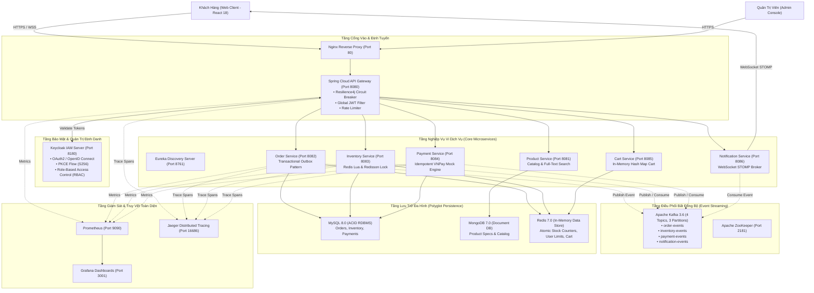

# ⚡ HỆ THỐNG THƯƠNG MẠI ĐIỆN TỬ FLASH SALE TẢI CAO (DISTRIBUTED MICROSERVICES PLATFORM)

[](https://spring.io/projects/spring-boot)
[](https://spring.io/projects/spring-cloud)
[](https://react.dev/)
[](https://kafka.apache.org/)
[](https://redis.io/)
[-blueviolet.svg?logo=keycloak)](https://www.keycloak.org/)
[](https://www.docker.com/)
[](https://github.com/features/actions)

Hệ thống Thương Mại Điện Tử Chịu Tải Cao Hỗ Trợ Flash Sale được xây dựng theo **Kiến trúc Vi dịch vụ Hướng Sự kiện (Event-Driven Microservices Architecture)**, thiết kế để giải quyết triệt để bài toán tranh chấp tồn kho (Race Condition), nghẽn cổ chai cơ sở dữ liệu quan hệ, và bảo đảm tính nhất quán giao dịch phân tán (Distributed Data Consistency) dưới áp lực hàng ngàn truy vấn đồng thời trong mỗi giây.

---

## 🏛️ SƠ ĐỒ KIẾN TRÚC HỆ THỐNG TỔNG THỂ



---

## 🌟 ĐẶC TRƯNG KIẾN TRÚC NỔI BẬT

1. **Trừ Tồn Kho Nguyên Tử $O(1)$ với Redis Lua Script:**
   * Thay vì dùng `SELECT ... FOR UPDATE` làm nghẽn RDBMS, thuật toán trừ tồn kho và kiểm soát hạn mức (tối đa 2 sản phẩm/khách) được đóng gói trong **Redis Lua Script**, thực thi nguyên tử trong **0.8ms – 1.5ms**, triệt tiêu 100% rủi ro bán âm kho (Overselling) và Race Condition.
2. **Giao Dịch Phân Tán Saga Choreography & Transactional Outbox:**
   * Quản lý giao dịch đa dịch vụ (Order -> Inventory -> Payment -> Notification) theo mô hình Saga Choreography phối hợp cùng Transactional Outbox Pattern, giải quyết triệt để bài toán Dual-Write và bảo đảm tính nhất quán dữ liệu cuối cùng (**Eventual Consistency**).
3. **Khóa Phân Tán Redisson (Distributed Lock):**
   * Bảo vệ các vùng dữ liệu tranh chấp cao trong cơ sở dữ liệu với thuật toán đồng thuận phân tán, cơ chế Watchdog tự động gia hạn thời gian khóa và phòng chống Deadlock.
4. **Bảo Mật Chuẩn Doanh Nghiệp (Keycloak OIDC PKCE):**
   * Triển khai chuẩn OAuth 2.1 với **Authorization Code Flow with PKCE** (S256), Frontend hoàn toàn không lưu Client Secret; phân quyền người dùng theo vai trò (RBAC) với `ROLE_CUSTOMER` và `ROLE_ADMIN`.
5. **Khả Năng Chống Chịu & Tự Phục Hồi (Resilience4j Circuit Breaker):**
   * Tích hợp Circuit Breaker tại API Gateway; khi một vi dịch vụ gặp sự cố, hệ thống ngắt mạch tự động và kích hoạt Fallback trong 15ms, ngăn chặn sập dây chuyền (Cascading Failure).
6. **Lưu Trữ Đa Hình (Polyglot Persistence):**
   * Kết hợp linh hoạt MySQL 8.0 (quan hệ ACID), MongoDB 7.0 (tài liệu linh hoạt) và Redis 7.0 (bộ nhớ tốc độ cao).
7. **Hạ Tầng Giám Sát Đầy Đủ (Full-Stack Observability):**
   * Đo kiểm thời gian thực qua Prometheus, Dashboard Grafana chuyên dụng theo dõi RPS, p95 Latency, DB Connection Pool và Jaeger truy vết Span Tree phân tán.

---

## 📊 MA TRẬN PHÂN HỆ VI DỊCH VỤ

| Tên Vi dịch vụ | Cổng (Port) | Công nghệ / Framework | Cơ sở dữ liệu / Storage | Nhiệm vụ chính & Mẫu thiết kế |
| :--- | :--- | :--- | :--- | :--- |
| **`eureka-server`** | `8761` | Spring Cloud Netflix Eureka | Bộ nhớ tạm (In-Memory) | Đăng ký dịch vụ, phát hiện dịch vụ (Service Discovery) & Heartbeat |
| **`api-gateway`** | `8080` | Spring Cloud Gateway (Netty) | - | Cổng vào tập trung, Circuit Breaker Resilience4j, xác thực JWT, Rate Limiter |
| **`product-service`** | `8081` | Spring Boot 3 + Spring Data | MongoDB 7.0 | Danh mục sản phẩm, tìm kiếm, lọc phân loại (Tự động gieo 24 sản phẩm mẫu) |
| **`order-service`** | `8082` | Spring Boot 3 + JPA | MySQL 8.0 + Redis 7.0 | Tiếp nhận đơn hàng, Transactional Outbox Pattern, phát sự kiện Saga lên Kafka |
| **`inventory-service`**| `8083` | Spring Boot 3 + JPA | MySQL 8.0 + Redis 7.0 | Quản lý phiên Flash Sale, trừ kho nguyên tử Redis Lua, Redisson Lock, Inbox Pattern |
| **`payment-service`** | `8084` | Spring Boot 3 + JPA | MySQL 8.0 | Xử lý thanh toán mô phỏng VNPay Sandbox, đảm bảo tính Idempotency |
| **`cart-service`** | `8085` | Spring Boot 3 + Spring Data | Redis 7.0 | Giỏ hàng thời gian thực trên Redis Hash Map $O(1)$ |
| **`notification-service`**| `8086` | Spring Boot 3 + WebSocket STOMP | - | Lắng nghe Kafka `PaymentCompletedEvent`, bắn thông báo đơn hàng realtime tới Web |
| **`frontend`** | `3000` | React 18 + Vite + TS + Zustand | Browser Cache | Giao diện khách hàng mua sắm Flash Sale, theo dõi tiến trình Saga thời gian thực |

---

## 💻 YÊU CẦU TIÊN QUYẾT (PREREQUISITES)

* **Docker Desktop:** Phiên bản 24.0+ (đã bật Docker Engine, khuyến nghị cấp phát tối thiểu 4 Cores CPU và 6GB - 8GB RAM).
* **JDK (Tùy chọn nếu muốn chạy Local không qua Docker):** JDK 17 (Eclipse Temurin hoặc Oracle JDK 17).
* **Apache Maven (Tùy chọn):** Maven 3.9+.
* **Node.js (Tùy chọn):** Node.js 18+ hoặc 20+.

---

## 🚀 HƯỚNG DẪN KHỞI CHẠY SIÊU TỐC (QUICK START VIA DOCKER COMPOSE)

Toàn bộ hệ thống gồm 18 containers (cơ sở dữ liệu, middleware, 8 microservices và frontend) đã được tự động hóa 100%:
* Tự động khởi tạo 4 Kafka Topics với 3 Partitions.
* Tự động import Realm `ecommerce-realm` có sẵn tài khoản mẫu vào Keycloak.
* Tự động gieo dữ liệu (Seed Data) gồm 24 sản phẩm thực tế và tồn kho vào MongoDB và MySQL.

```bash
# 1. Di chuyển vào thư mục gốc của repository
cd src

# 2. Tạo tệp cấu hình môi trường từ mẫu (nếu chưa có)
cp .env.example .env

# 3. Khởi chạy toàn bộ hệ thống bằng 1 lệnh duy nhất
docker compose up -d --build
```

*(Mẹo: Nếu máy của bạn đã cài sẵn Maven, bạn có thể đóng gói JAR trước để Docker build chỉ mất 1-2 phút thay vì kéo thư viện trong container:)*
```bash
cd backend && mvn clean package -DskipTests && cd ..
docker compose up -d --build
```

### Kiểm Tra Trạng Thái Sau Khi Khởi Động:
```bash
docker ps --format "table {{.Names}}\t{{.Status}}\t{{.Ports}}"
```
Đảm bảo toàn bộ 18 containers đều ở trạng thái `Up (healthy)` hoặc `Up`.

---

## 🛠️ HƯỚNG DẪN CHẠY MÔ HÌNH HYBRID LOCAL DEV (DÀNH CHO LẬP TRÌNH VIÊN)

Nếu bạn muốn chạy trực tiếp mã nguồn trên IDE (IntelliJ IDEA / VSCode) để debug từng dòng mã:

1. **Khởi động Middleware hạ tầng bằng Docker:**
   ```bash
   cd src
   docker compose up -d mysql-db mongodb redis zookeeper kafka kafka-init-topics keycloak prometheus grafana jaeger
   ```
2. **Khởi động các dịch vụ Spring Boot:**
   * Eureka Server: `cd backend/eureka-server && mvn spring-boot:run` (Port 8761)
   * API Gateway: `cd backend/api-gateway && mvn spring-boot:run` (Port 8080)
   * Product Service: `cd backend/product-service && mvn spring-boot:run` (Port 8081)
   * Order Service: `cd backend/order-service && mvn spring-boot:run` (Port 8082)
   * Inventory Service: `cd backend/inventory-service && mvn spring-boot:run` (Port 8083)
   * Payment Service: `cd backend/payment-service && mvn spring-boot:run` (Port 8084)
   * Cart Service: `cd backend/cart-service && mvn spring-boot:run` (Port 8085)
   * Notification Service: `cd backend/notification-service && mvn spring-boot:run` (Port 8086)
3. **Khởi động Web Client:**
   ```bash
   cd frontend
   cp .env.example .env
   npm install
   npm run dev
   ```

---

## 📌 BẢNG ĐIỀU HƯỚNG TRUY CẬP VÀ TÀI KHOẢN MẶC ĐỊNH

| Cổng dịch vụ | Địa chỉ truy cập (URL) | Tài khoản / Mật khẩu | Mục đích sử dụng |
| :--- | :--- | :--- | :--- |
| **Giao diện Web Khách hàng** | `http://localhost:3000` | `customer` / `password` | Trải nghiệm mua sắm, săn Flash Sale, xem tiến trình Saga |
| **Spring Cloud API Gateway** | `http://localhost:8080` | - | Cổng API tập trung, xem Actuator Health `/actuator/health` |
| **Eureka Service Registry** | `http://localhost:8761` | *Không cần mật khẩu* | Bảng giám sát danh sách các microservices đang trực tuyến |
| **Keycloak IAM Server** | `http://localhost:8180` | `admin` / `adminpassword` | Quản trị định danh OAuth2, xem Realm `ecommerce-realm` & PKCE Client |
| **Grafana Monitoring** | `http://localhost:3001` | `admin` / `admin123456` | Dashboard đo tải: Throughput RPS, p95 Latency, DB Connection Pool |
| **Prometheus Metrics** | `http://localhost:9090` | *Không cần mật khẩu* | Máy chủ cào dữ liệu chỉ số hiệu năng (Actuator Scraper) |
| **Jaeger Distributed Tracing**| `http://localhost:16686` | *Không cần mật khẩu* | Quan sát Span Tree truy vết chuỗi phân tán xuyên suốt các dịch vụ |

---

## 🧪 HƯỚNG DẪN KIỂM THỬ TOÀN DIỆN (TESTING & VERIFICATION)

Hệ thống được đóng gói đầy đủ các bộ công cụ kiểm thử tự động, từ tầng Unit Test đến kiểm thử chịu tải phân tán:

### 1. Kiểm thử Tự Động Kịch Bản Nghiệp Vụ (Zero-Dependency Node Runner):
Tự động gửi đơn hàng, đối soát mã trạng thái HTTP và kiểm tra trực tiếp số dư tồn kho trong MySQL:
```bash
node scripts/test_demo_scenarios_automation.mjs
```
*Kiểm tra trọn vẹn 4 kịch bản: Mua thành công (Happy Path), 5 người mua đồng thời, 5 người tranh mua 1 sản phẩm cuối (chống bán âm), và chặn mua vượt hạn mức cá nhân.*

### 2. Quan Sát Dòng Sự Kiện Phân Tán Thời Gian Thực (Realtime Kafka Streamer):
Mở 2 cửa sổ terminal song song:
* **Terminal 1:** `node scripts/kafka_live_tail.mjs` (Lắng nghe sự kiện 4 topics Kafka)
* **Terminal 2:** `node scripts/realtime_scenario_runner.mjs 1` (Kích hoạt luồng đặt hàng)
* *Hiện tượng:* Terminal 1 lập tức nhảy ra 4 dòng sự kiện có màu sắc trực quan thể hiện từng bước Saga di chuyển.

### 3. Kiểm Thử Chịu Tải Cao (Distributed Load Testing):
Hỗ trợ 3 động cơ kiểm thử tải linh hoạt:
```powershell
# Chạy bằng Apache JMeter 5.6.3 (xuất báo cáo HTML đồ thị trực quan):
powershell -ExecutionPolicy Bypass -File .\scripts\load-testing\run_load_test.ps1 -Engine jmeter -Threads 500 -Duration 30

# Chạy bằng High-Concurrency Runner (Zero-Dependency):
powershell -ExecutionPolicy Bypass -File .\scripts\load-testing\run_load_test.ps1 -Engine runner -Requests 5000 -Concurrency 50

# Chạy bằng k6 Cloud Native:
powershell -ExecutionPolicy Bypass -File .\scripts\load-testing\run_load_test.ps1 -Engine k6
```

### 4. Kiểm Thử Tầng Mã Nguồn (Unit & Integration Tests):
```bash
# Kiểm thử toàn bộ Backend Spring Boot:
cd backend && mvn clean test

# Kiểm thử Frontend React (Vitest):
cd frontend && npm test
```

---

## 📚 TÀI LIỆU CHUYÊN SÂU ĐÍNH KÈM (DOCUMENTATION SUITE)

Để tìm hiểu chi tiết các khía cạnh kỹ thuật chuyên sâu, vui lòng tham khảo các tài liệu trong thư mục [`docs/`](docs/):

* 🏛️ **[Tài liệu Kiến trúc Kỹ thuật Hệ thống (`docs/ARCHITECTURE.md`)](docs/ARCHITECTURE.md):** Phân tích sâu thuật toán Redis Lua $O(1)$, Saga Choreography, Outbox Table, Redisson Lock, Phân vùng Kafka và Lưu trữ Đa hình.
* 🧪 **[Cẩm nang Kiểm thử & Đối soát (`docs/TESTING_AND_VERIFICATION_GUIDE.md`)](docs/TESTING_AND_VERIFICATION_GUIDE.md):** Hướng dẫn chi tiết từng bước chạy, đọc và giải thích các bài test.
* 🎓 **[Kịch bản Trình chiếu Demo Thực chiến (`docs/LIVE_DEMO_GUIDE.md`)](docs/LIVE_DEMO_GUIDE.md):** Bản kế hoạch chi tiết từng bước thuyết minh và các điểm nhấn kỹ thuật khi bảo vệ trước Hội đồng.
* 📖 **[Danh mục Tra cứu API Hệ thống (`docs/api/API_REFERENCE.md`)](docs/api/API_REFERENCE.md):** Chi tiết các API RESTful và kết nối WebSocket STOMP.
* 📮 **[Bộ Postman Collection (`docs/api/Flash_Sale_ECommerce_API.postman_collection.json`)](docs/api/Flash_Sale_ECommerce_API.postman_collection.json):** Tệp cấu hình có thể import trực tiếp vào Postman / Insomnia để thử nghiệm tất cả các API.

---

## 🚀 QUY TRÌNH CI/CD TỰ ĐỘNG (GITHUB ACTIONS & DOCKER REGISTRY)

Dự án tích hợp đường ống tích hợp và triển khai liên tục (**CI/CD Pipeline**) qua GitHub Actions (`.github/workflows/ci-cd.yml`):
1. **Kiểm tra tự động:** Mỗi khi có mã nguồn mới đẩy lên, GitHub Actions tự động biên dịch và kiểm thử toàn bộ các phân hệ Spring Boot (JDK 17) và React SPA (Node.js 22).
2. **Đóng gói Docker:** Tự động Build các Docker Images cho từng vi dịch vụ và đẩy lên **GitHub Container Registry (GHCR.io)**.
3. **Triển khai Máy chủ:** Tự động SSH vào máy chủ Linux Server (Ubuntu) của bạn và thực thi `docker compose pull && docker compose up -d` không làm gián đoạn hệ thống.

---

## 📁 CẤU TRÚC THƯ MỤC NGUỒN (CODEBASE DIRECTORY TREE)

```text
src/
├── .github/
│   └── workflows/
│       └── ci-cd.yml                  # Đường ống tự động Build, Test & Deploy lên Server
├── .gitignore                         # Bộ lọc chuẩn loại bỏ file rác, binary, IDE và test artifacts
├── .env.example                       # Tệp biến môi trường mẫu cho hạ tầng Docker Compose
├── docker-compose.yml                 # Điều phối 18 containers (MySQL, Mongo, Redis, Kafka, Services)
├── README.md                          # Tài liệu hướng dẫn trung tâm của dự án
├── docs/                              # Bộ tài liệu kỹ thuật chuyên sâu
│   ├── ARCHITECTURE.md                # Phân tích kiến trúc Saga, Redis Lua, Outbox, Redisson
│   ├── TESTING_AND_VERIFICATION_GUIDE.md # Cẩm nang hướng dẫn kiểm thử và đối soát
│   ├── LIVE_DEMO_GUIDE.md             # Kịch bản thuyết minh demo thực chiến
│   └── api/                           # Tài liệu API & Postman Collection
│       ├── API_REFERENCE.md
│       └── Flash_Sale_ECommerce_API.postman_collection.json
├── backend/                           # Mã nguồn các dịch vụ Spring Boot Microservices
│   ├── pom.xml                        # Maven Parent POM quản lý phiên bản và dependencies
│   ├── eureka-server/                 # Service Discovery (Port 8761)
│   ├── api-gateway/                   # Spring Cloud Gateway + Circuit Breaker (Port 8080)
│   ├── product-service/               # Catalog Service + MongoDB 7.0 (Port 8081)
│   ├── order-service/                 # Order Service + Transactional Outbox + MySQL (Port 8082)
│   ├── inventory-service/             # Flash Sale Engine + Redis Lua + MySQL (Port 8083)
│   ├── payment-service/               # Idempotent Payment Service + MySQL (Port 8084)
│   ├── cart-service/                  # Shopping Cart Service + Redis (Port 8085)
│   ├── notification-service/          # WebSocket Push Notifications (Port 8086)
│   └── common-dto/                    # Thư viện DTO và Event Schemas dùng chung giữa các services
├── frontend/                          # Mã nguồn Web Client (React 18 + TS + Vite + Zustand)
│   ├── .env.example                   # Biến môi trường mẫu cho Client
│   ├── Dockerfile                     # Multi-stage Dockerfile tối ưu kích thước
│   ├── package.json                   # Dependencies quản lý gói
│   └── src/                           # Components, Pages, Stores Zustand & Services
├── keycloak/                          # Cấu hình Keycloak IAM
│   ├── ecommerce-realm.json           # Realm export tự động nạp Roles, Clients PKCE, Users
│   └── themes/                        # Giao diện đăng nhập tùy biến
├── monitoring/                        # Hạ tầng Giám sát & Metrics
│   ├── prometheus/                    # Cấu hình cào số liệu prometheus.yml
│   └── grafana/                       # Provisioning & Dashboard JSON giám sát Flash Sale
├── nginx/                             # Cấu hình Reverse Proxy & Ingress
│   └── ingress.conf
├── deploy/                            # Cấu hình triển khai mở rộng
│   └── k8s/                           # Toàn bộ Manifests Kubernetes (Deployments, Services, ConfigMaps)
└── scripts/                           # Bộ công cụ vận hành & kịch bản kiểm thử
    ├── test_demo_scenarios_automation.mjs # Bộ kiểm thử 4 kịch bản tự động
    ├── kafka_live_tail.mjs            # Công cụ bắt sóng tin nhắn Kafka thời gian thực
    ├── realtime_scenario_runner.mjs   # Bộ phát sinh luồng dữ liệu mua hàng có kiểm soát
    └── load-testing/                  # Kịch bản kiểm thử chịu tải (JMeter .jmx, k6, Node runner)
        ├── run_load_test.ps1
        ├── flashsale_10k_users.jmx
        ├── flashsale_10k_vu.js
        └── high_load_runner.mjs
```
