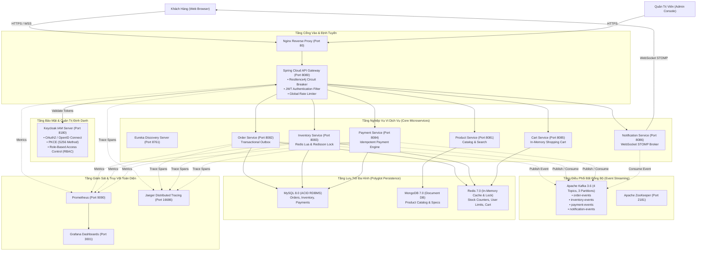
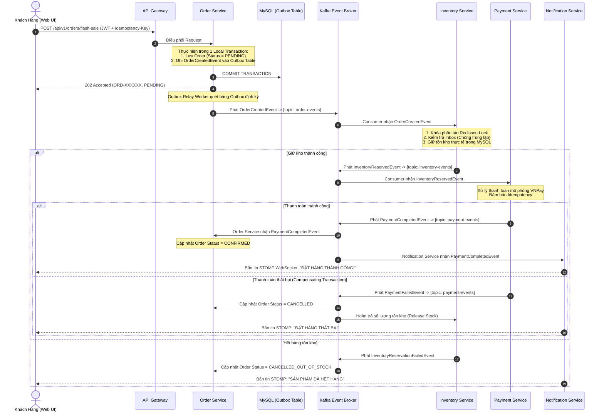

# 🏛️ TÀI LIỆU KIẾN TRÚC KỸ THUẬT HỆ THỐNG (SYSTEM ARCHITECTURE)

Hệ thống Thương Mại Điện Tử Hỗ Trợ Flash Sale Tải Cao được thiết kế theo mô hình **Kiến trúc Vi dịch vụ Hướng Sự kiện (Event-Driven Microservices Architecture)**, kết hợp các mẫu thiết kế công nghiệp tiên tiến để giải quyết triệt để bài toán thắt nút cổ chai (bottleneck), tranh chấp tài nguyên (race condition) và tính nhất quán dữ liệu phân tán (distributed data consistency).

---

## 📐 1. TỔNG QUAN KIẾN TRÚC ĐA TẦNG (HIGH-LEVEL ARCHITECTURE)

---

## ⚡ 2. CƠ CHẾ SĂN HÀNG FLASH SALE ĐỘC QUYỀN (O(1) REDIS LUA SCRIPT)

Trong các phiên bán hàng chớp nhoáng (Flash Sale), hàng chục ngàn người dùng cùng tranh mua số lượng sản phẩm có hạn trong tích tắc. Nếu ghi thẳng xuống cơ sở dữ liệu quan hệ (RDBMS) bằng các câu lệnh `SELECT ... FOR UPDATE`, hệ thống sẽ lập tức rơi vào trạng thái nghẽn khóa (Deadlock/Row-Lock Contention) và suy sụp (Cascading Failure).

Hệ thống áp dụng giải pháp **Tách rời luồng xử lý bộ nhớ (In-Memory Isolation)**:

1. **Khởi tạo bộ nhớ (Cache Warming):** Trước khi phiên mở, số lượng tồn kho mở bán và hạn mức mua tối đa được nạp sẵn vào Redis.
2. **Thực thi nguyên tử qua Lua Script:** Thuật toán trừ tồn kho và kiểm soát hạn mức được gói gọn trong 1 kịch bản Lua Script duy nhất chạy trực tiếp trên Redis Engine:
   * **Nguyên tử tuyệt đối (Atomicity):** Do Redis xử lý đơn luồng sự kiện (Single-Threaded Event Loop), mã Lua được đảm bảo không bị xen ngang bởi bất kỳ tiến trình nào khác, triệt tiêu 100% rủi ro Race Condition.
   * **Độ phức tạp $O(1)$:** Thời gian thực thi chỉ từ 0.8ms đến 1.5ms, giải phóng hoàn toàn cơ sở dữ liệu quan hệ khỏi áp lực tải đỉnh.
3. **Thuật toán kiểm soát 3 lớp trong Lua Script:**
   * **Lớp 1:** Kiểm tra sự tồn tại của phiên Flash Sale và sản phẩm.
   * **Lớp 2 (Hạn mức cá nhân):** Kiểm tra `user_purchased_count + requested_qty <= max_limit` (mặc định tối đa 2 sản phẩm/khách hàng).
   * **Lớp 3 (Chống bán âm kho):** Kiểm tra `current_stock >= requested_qty`. Nếu đủ, thực hiện trừ kho và tăng biến đếm của user ngay trong 1 bước duy nhất.

---

## 🔄 3. QUẢN LÝ GIAO DỊCH PHÂN TÁN: SAGA CHOREOGRAPHY & TRANSACTIONAL OUTBOX

Hệ thống áp dụng mô hình **Saga Choreography (Biên đạo múa)** phối hợp cùng mẫu thiết kế **Transactional Outbox Pattern** để đảm bảo tính nhất quán cuối cùng (Eventual Consistency) mà không dùng đến 2-Phase Commit (2PC) vốn làm chậm hệ thống.

### Các Nguyên Tắc Thiết Kế Trọng Yếu:
1. **Transactional Outbox Pattern:** Giải quyết bài toán Dual-Write Problem (vừa lưu DB vừa bắn message). Message được ghi vào bảng `outbox_events` trong cùng một transaction cục bộ của RDBMS. Tiến trình background đọc outbox và đẩy lên Kafka với bảo đảm **At-Least-Once Delivery**.
2. **Idempotent Consumer (Mẫu thiết kế Xử lý Bất Biến):** Mọi consumer (Inventory, Payment, Notification) đều ghi nhận khóa thông điệp vào bảng `inbox_events`. Nếu Kafka gửi lại một sự kiện đã xử lý, consumer lập tức nhận diện và bỏ qua (Deduplication).
3. **Compensating Transactions (Giao dịch Bù trừ):** Khi bất kỳ bước nào trong chuỗi Saga gặp sự cố (như thanh toán thất bại, user hủy thanh toán), hệ thống phát sự kiện bù trừ ngược lại để hoàn trả tồn kho và cập nhật trạng thái đơn hàng.

---

## 🔒 4. MÔ HÌNH BẢO MẬT & ĐỊNH DANH (KEYCLOAK OIDC PKCE)

1. **Chuẩn Authorization Code Flow với PKCE (RFC 7636):**
   * Frontend (Single Page Application) là Public Client. Hệ thống **tuyệt đối không nhúng Client Secret** vào mã nguồn JS/TS để loại bỏ hoàn toàn nguy cơ rò rỉ mã bí mật.
   * Trao đổi mã cấp phép sử dụng cặp `code_verifier` và `code_challenge` theo thuật toán băm SHA-256 (`S256`).
2. **Xác thực Không Trạng Thái (Stateless JWT Verification):**
   * API Gateway tự động lấy Public Key (JWKS) từ Keycloak để thẩm định tính hợp lệ của chữ ký điện tử trên Access Token.
   * Các microservices tầng dưới tin tưởng Header `X-User-Id` và các Claim được Gateway chuyển tiếp sau khi đã qua bước lọc an ninh.
3. **Phân Quyền Dựa Trên Vai Trò (RBAC):**
   * Phân quyền chặt chẽ thông qua Realm Roles: `ROLE_CUSTOMER` (người dùng mua sắm) và `ROLE_ADMIN` (quản trị viên cấu hình tồn kho, phiên bán).

---

## 🛡️ 5. KHẢ NĂNG CHỐNG CHỊU & PHỤC HỒI (RESILIENCE & FAULT TOLERANCE)

1. **Circuit Breaker (Bộ ngắt mạch Resilience4j):**
   * Được thiết lập tại tầng API Gateway cho toàn bộ các route điều hướng.
   * Ngưỡng mở mạch (Open State): Khi tỷ lệ lỗi vượt quá 50% hoặc thời gian phản hồi vượt quá 2 giây trong cửa sổ trượt (Sliding Window), mạch tự động mở, ngăn chặn hiện tượng quá tải dây chuyền (Cascading Failure).
2. **Fallback Mechanism:**
   * Khi mạch mở, Gateway tự động chuyển hướng request sang các Controller dự phòng (`FallbackController`), trả về mã HTTP `503 Service Unavailable` kèm phản hồi JSON thân thiện thay vì để kết nối bị treo (Connection Timeout).

---

## 📈 6. BẢN ĐỒ GIÁM SÁT TOÀN DIỆN (FULL-STACK OBSERVABILITY)

* **Metrics Scraping (Prometheus):** Tự động thu thập chỉ số định kỳ mỗi 5 giây từ `/actuator/prometheus` của từng Spring Boot container (JVM Memory, GC Pauses, HikariCP Connection Pool, HTTP Request Rates).
* **Trực quan hóa (Grafana):** Dashboard thiết kế chuyên dụng **Flash Sale System Overview** giám sát: Throughput (RPS), Phân vị Latency P95/P99, Tỷ lệ lỗi 5xx, Tỷ trọng loại yêu cầu (Request Mix).
* **Truy vết Phân tán (Jaeger Tracing):** Sử dụng OpenTelemetry Java Agent tự động thu thập Span Tree xuyên suốt từ Gateway -> Order -> Kafka -> Inventory -> Payment, giúp cô lập điểm nghẽn độ trễ tức thời.
