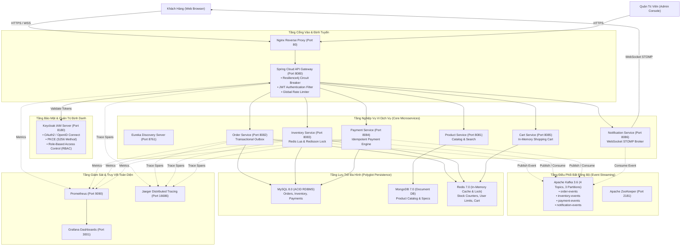

# TÀI LIỆU KIẾN TRÚC KỸ THUẬT HỆ THỐNG (SYSTEM ARCHITECTURE)

Hệ thống Thương Mại Điện Tử Hỗ Trợ Flash Sale Tải Cao được thiết kế theo mô hình **Kiến trúc Vi dịch vụ Hướng Sự kiện (Event-Driven Microservices Architecture)**, kết hợp các mẫu thiết kế công nghiệp nhằm giải quyết triệt để bài toán thắt nút cổ chai (bottleneck), tranh chấp tài nguyên (race condition) và tính nhất quán dữ liệu phân tán (distributed data consistency).

---

## 1. TỔNG QUAN KIẾN TRÚC HỆ THỐNG (HIGH-LEVEL ARCHITECTURE)

---

## 2. CƠ CHẾ XỬ LÝ ĐỒNG THỜI VÀ TRỪ TỒN KHO NGUYÊN TỬ (REDIS LUA SCRIPT)

Trong các phiên bán hàng Flash Sale, lượng truy cập đồng thời lớn tập trung vào một số lượng sản phẩm hữu hạn. Việc cập nhật trực tiếp xuống cơ sở dữ liệu quan hệ (RDBMS) bằng các truy vấn khóa dòng `SELECT ... FOR UPDATE` sẽ dẫn đến hiện tượng nghẽn hàng đợi (Deadlock/Row-Lock Contention) và suy giảm hiệu năng toàn hệ thống.

Hệ thống triển khai giải pháp **Cách ly xử lý trên bộ nhớ (In-Memory Isolation)**:

1. **Khởi tạo dữ liệu trên bộ nhớ đệm (Cache Warming):** Trước khi phiên bán diễn ra, chỉ số tồn kho khả dụng và hạn mức mua tối đa được đồng bộ nạp sẵn vào Redis.
2. **Thực thi nguyên tử qua Lua Script:** Thuật toán kiểm tra điều kiện, trừ tồn kho và ghi nhận hạn mức được đóng gói trong một kịch bản Lua Script thực thi trực tiếp trên Redis Engine:
   * **Tính nguyên tử (Atomicity):** Redis xử lý lệnh trên mô hình vòng lặp sự kiện đơn luồng (Single-Threaded Event Loop), đảm bảo kịch bản Lua được thực thi trọn vẹn mà không bị gián đoạn, loại bỏ hoàn toàn hiện tượng Race Condition.
   * **Độ phức tạp $O(1)$:** Thời gian phản hồi đạt từ 0.8ms đến 1.5ms, giải phóng cơ sở dữ liệu quan hệ khỏi áp lực tải đỉnh điểm.
3. **Quy trình kiểm soát 3 tầng trong Lua Script:**
   * **Tầng 1:** Xác thực sự tồn tại của phiên Flash Sale và sản phẩm tương ứng.
   * **Tầng 2 (Hạn mức người dùng):** Kiểm tra điều kiện `user_purchased_count + requested_qty <= max_limit` (mặc định tối đa 2 sản phẩm/khách hàng).
   * **Tầng 3 (Chống bán âm kho):** Kiểm tra điều kiện `current_stock >= requested_qty`. Khi thỏa mãn, hệ thống thực hiện giảm trừ tồn kho và cập nhật số lượng đã mua của người dùng trong một thao tác duy nhất.

---

## 3. QUẢN LÝ GIAO DỊCH PHÂN TÁN: SAGA CHOREOGRAPHY VÀ TRANSACTIONAL OUTBOX

Hệ thống áp dụng mô hình **Saga Choreography** kết hợp mẫu thiết kế **Transactional Outbox Pattern** để đảm bảo tính nhất quán dữ liệu cuối cùng (Eventual Consistency) giữa các vi dịch vụ mà không cần sử dụng giao thức khóa phân tán hai pha (2-Phase Commit):

### Các Nguyên Tắc Thiết Kế Trọng Yếu:
1. **Transactional Outbox Pattern:** Giải quyết bài toán ghi dữ liệu kép (Dual-Write Problem). Bản ghi sự kiện được lưu vào bảng `outbox_events` trong cùng transaction cục bộ của RDBMS. Tiến trình background định kỳ quét bảng outbox và chuyển tiếp thông điệp lên Kafka với cơ chế bảo đảm phân phát ít nhất một lần (**At-Least-Once Delivery**).
2. **Idempotent Consumer:** Các dịch vụ nhận thông điệp (Inventory, Payment, Notification) đều lưu trữ mã định danh thông điệp vào bảng `inbox_events`. Khi gặp lại thông điệp trùng lặp từ Kafka, consumer chủ động nhận diện và bỏ qua (Deduplication).
3. **Compensating Transactions (Giao dịch bù trừ):** Khi có bước xử lý gặp sự cố (thanh toán thất bại hoặc hủy đơn), hệ thống phát sự kiện bù trừ ngược lại nhằm hoàn trả tài nguyên kho đã giữ chỗ và cập nhật trạng thái đơn hàng sang `CANCELLED`.

---

## 4. MÔ HÌNH BẢO MẬT VÀ QUẢN LÝ ĐỊNH DANH (KEYCLOAK OIDC PKCE)

1. **Chuẩn Authorization Code Flow kết hợp PKCE (RFC 7636):**
   * Phía giao diện Single Page Application đóng vai trò là Public Client, không lưu trữ Client Secret để loại bỏ nguy cơ lộ mã bảo mật.
   * Trao đổi mã cấp phép sử dụng cặp khóa `code_verifier` và `code_challenge` mã hóa qua thuật toán SHA-256 (`S256`).
2. **Xác thực JWT không trạng thái (Stateless JWT Verification):**
   * API Gateway nạp Public Key (JWKS) từ Keycloak để thẩm định tính toàn vẹn của chữ ký điện tử trên Access Token.
   * Các vi dịch vụ nghiệp vụ nội bộ tiếp nhận các trường định danh như `X-User-Id` và các Claim do Gateway chuyển tiếp sau khi đã thẩm định an toàn.
3. **Phân quyền dựa trên vai trò (RBAC):**
   * Thiết lập phân quyền qua Realm Roles: `ROLE_CUSTOMER` (người dùng mua sắm) và `ROLE_ADMIN` (quản trị viên cấu hình phiên bán và số liệu tồn kho).

---

## 5. KHẢ NĂNG CHỐNG CHỊU VÀ DUNG LỖI (RESILIENCE & FAULT TOLERANCE)

1. **Circuit Breaker (Resilience4j):**
   * Được cấu hình tại tầng API Gateway cho toàn bộ các tuyến định tuyến dịch vụ.
   * Điều kiện kích hoạt trạng thái mở mạch (Open): Khi tỷ lệ lỗi kỹ thuật vượt ngưỡng 50% hoặc thời gian phản hồi vượt quá 2 giây trong cửa sổ trượt (Sliding Window), mạch tự động mở nhằm ngăn chặn tình trạng suy sụp dây chuyền (Cascading Failure).
2. **Cơ chế phản hồi dự phòng (Fallback Mechanism):**
   * Khi mạch mở, Gateway chuyển hướng yêu cầu sang các bộ xử lý dự phòng (`FallbackController`), phản hồi mã HTTP `503 Service Unavailable` cùng cấu trúc dữ liệu JSON xác định thay vì để kết nối bị quá hạn (Gateway Timeout).

---

## 6. HẠ TẦNG GIÁM SÁT VÀ QUAN SÁT HỆ THỐNG (FULL-STACK OBSERVABILITY)

* **Thu thập chỉ số hiệu năng (Prometheus):** Tự động thu thập chỉ số định kỳ mỗi 5 giây từ các điểm cuối `/actuator/prometheus` của từng phiên bản Spring Boot (bộ nhớ JVM, chu kỳ Garbage Collection, kết nối HikariCP và tần suất yêu cầu HTTP).
* **Trực quan hóa chỉ số (Grafana):** Bảng điều khiển chuyên dụng **Flash Sale System Overview** hiển thị thông lượng (RPS), phân vị trễ p95/p99, tỷ lệ phản hồi lỗi HTTP 5xx và phân bổ lưu lượng truy cập.
* **Truy vết phân tán (Jaeger Tracing):** Sử dụng OpenTelemetry Java Agent tự động thu thập Span Tree từ Gateway xuyên qua chuỗi Order, Kafka, Inventory và Payment, hỗ trợ cô lập và phân tích điểm nghẽn hiệu năng.
